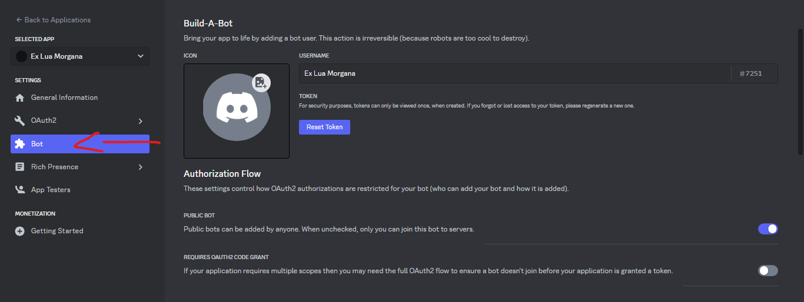

# **Discord-Tutorial-V14-JS**
- Olá, seja bem vindo(a) ao tutorial de como iniciar sua aplicação de forma que todo DEV Discord.js faz.

# **Topics 🔥**
- Baixando/Instalando Recursos para produção da aplicação.
- Criando aplicação no Portal do Desenvolvedor.
- Configurando a Aplicação criada.
- Gerando Link para adicionar no servidor.
- Indo/Configurando para o Editor de Código.
- Baixando as pendencias necessárias.
- Deixando ele online.
- Testando comando padrão.
- Colocando alguns comandos.
# **Seção 1: Baixando/Instalando Recursos para produção da aplicação.**
1) Abra seu navegador padrão do seu aparelho e pesquise por [**Visual Studio Code**](https://code.visualstudio.com/download)
2) Após instalar, vamos baixar o [NodeJS](https://nodejs.org/en/download/) *(Indicamos na LTS)*
# **Seção 2: Criando aplicação no Portal do Desenvolvedor.**
1) Abra seu navegador, e acesse o [Painel Developer Portal](https://discord.com/developers/applications)
2) Após entrar no site, basta clicar em **New Application** ou **Nova Aplicação.**
4) Quando clicar no botão, basta você digitar o nome do Seu bot.

# **Seção 3: Configurando a Aplicação criada.**
1) Após criar sua aplicação, iremos configurar para que funcione perfeitamente.
2) No canto esquerdo da tela, você acesse o botão **Bot**

3) Ative as **intents** do bot para que ele funcione. (Apenas desça um pouco na opção **Bot**
