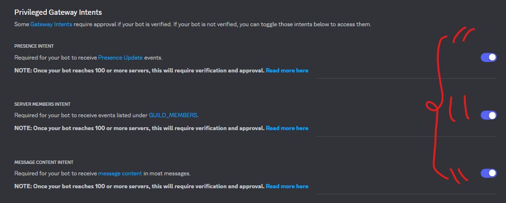
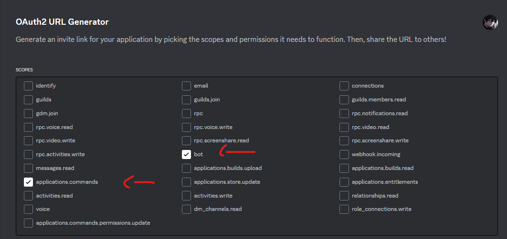
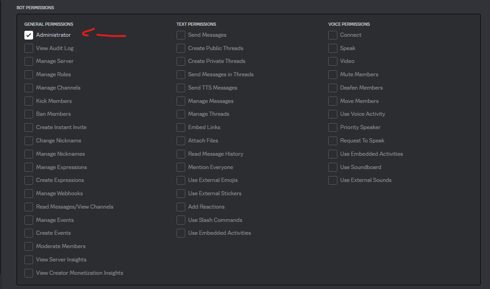
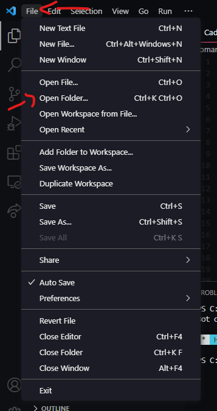

# **Discord-Tutorial-V14-JS**
- Olá, seja bem vindo(a) ao tutorial de como iniciar sua aplicação de forma que todo DEV Discord.js faz.

# **Topics 🔥**
- Baixando/Instalando Recursos para produção da aplicação.
- Criando aplicação no Portal do Desenvolvedor.
- Configurando a Aplicação criada.
- Gerando Link para adicionar no servidor.
- Indo/Configurando para o Editor de Código.
- Criando o código fonte do bot.
- Baixando as pendencias necessárias.
- Deixando ele online.
- Testando comando padrão.
- Colocando alguns comandos.
# **Seção 1: Baixando/Instalando Recursos para produção da aplicação.**
1) Abra seu navegador padrão do seu aparelho e pesquise por [**Visual Studio Code**](https://code.visualstudio.com/download)
2) Após instalar, vamos baixar o [NodeJS](https://nodejs.org/en/download/) *(Indicamos na LTS)*
# **Seção 2: Criando aplicação no Portal do Desenvolvedor.**
1) Abra seu navegador, e acesse o [Painel Developer Portal](https://discord.com/developers/applications)
2) Após entrar no site, basta clicar em **New Application** ou **Nova Aplicação.**
4) Quando clicar no botão, basta você digitar o nome do Seu bot.

# **Seção 3: Configurando a Aplicação criada.**
1) Após criar sua aplicação, iremos configurar para que funcione perfeitamente.
2) No canto esquerdo da tela, você acesse o botão **Bot**

3) Ative as **intents** do bot para que ele funcione. (Apenas desça um pouco na opção **Bot**)

4) Depois, clique em **Reset Token** e copie o token gerado. *(Não compartilhe este token a ninguém!

# **Seção 4: Gerando Link para adicionar no servidor.**
1) Acesse o botão **OAuth2** e clique outra vez em **URL Generator**
2) Habilite as seguintes informações:

3) E depois desça mais um pouco e você vai encontrar **GENERATED URL** e vai copiar e colar em outra página.
4) Depois de adicionado, vamos para a próxima seção.
# **Seção 5: Indo/Configurando para o Editor de Código.**
1) Após fizermos a aplicação, faça a instalação do Visual Studio Code normalmente.
2) Depois de fazer a instalação do Visual Studio Code, faça a instalação do NodeJS.
3) Após baixar tudo, você vai abrir o **Visual Studio Code** e esperar.
4) Depois de entrar, clique em **File** e depois em Open Folder.

5) Crie uma pasta para você iniciar a configurações do bot.
6) Após criar e abrir ele, vamos para a próxima etapa.
# **Seção 6: Criando o código fonte do bot.**
1) Após abrir, você vai clicar para criar um arquivo e você digita: **index.js**
